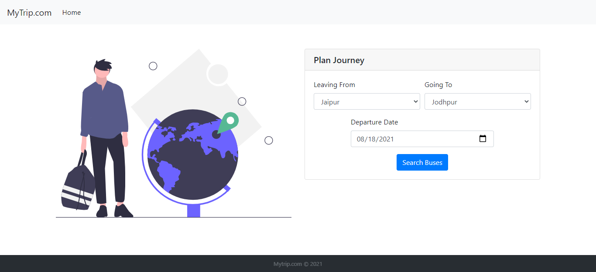
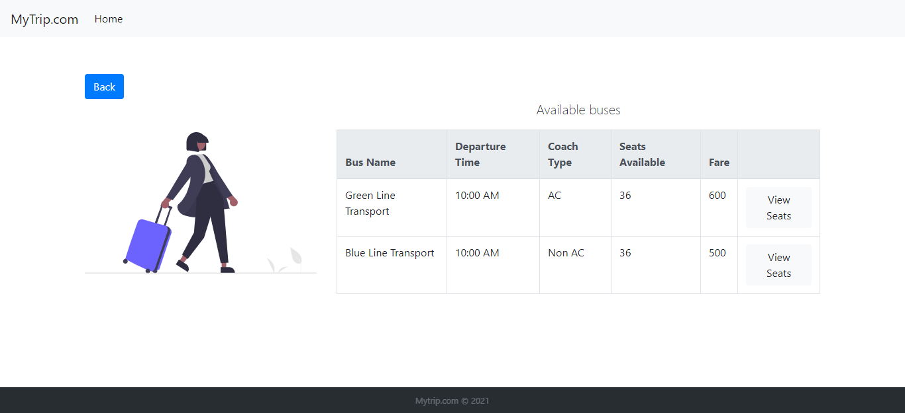
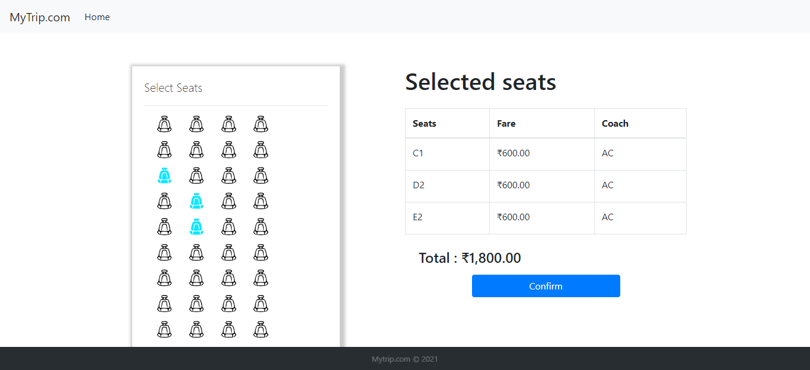
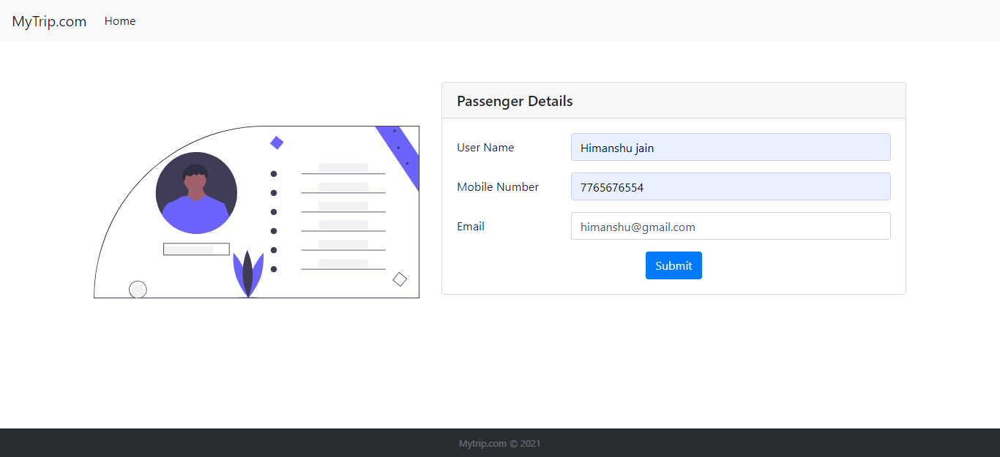
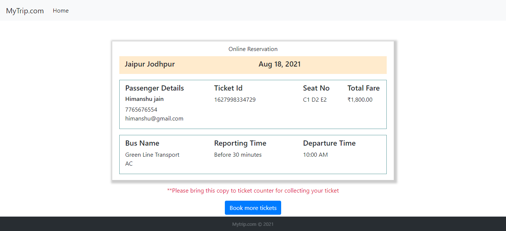

<h1>My Trip Bus Ticket Booking</h1>

## About
Ticket booking application front end made with [Angular 11](https://angular.io/) and [Bootstrap](https://getbootstrap.com/docs/4.6/getting-started/introduction/). 
System testing is done using [Pytest](https://docs.pytest.org/en/6.2.x/) and [Selenium](https://selenium-python.readthedocs.io/)

## Features
- Search buses(Plan journey)
- Select Seats
- Generate ticket

## Live project
Can be seen [here](https://i-gitit.github.io/BusTicketing_AngularApp/). Hosted using Github pages.

## Preview

